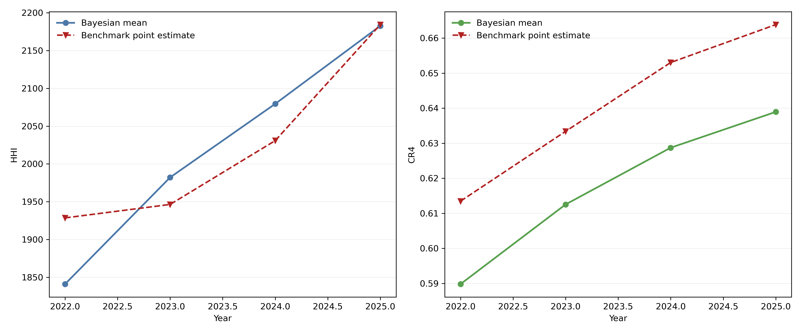
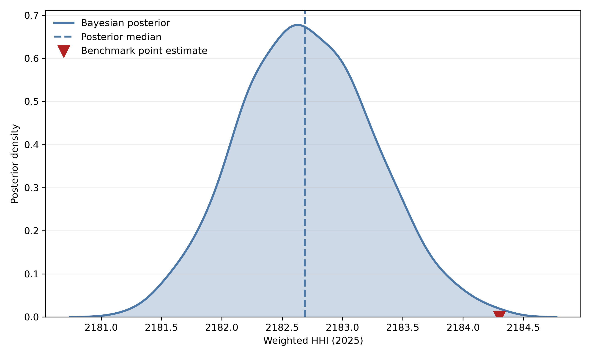
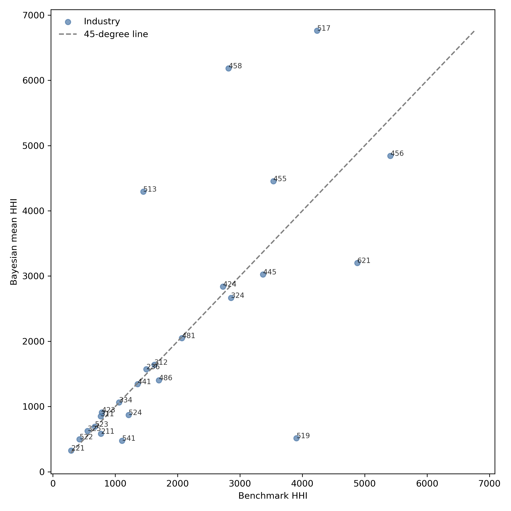
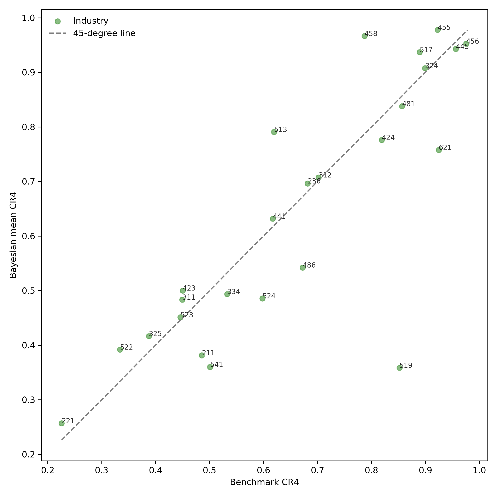
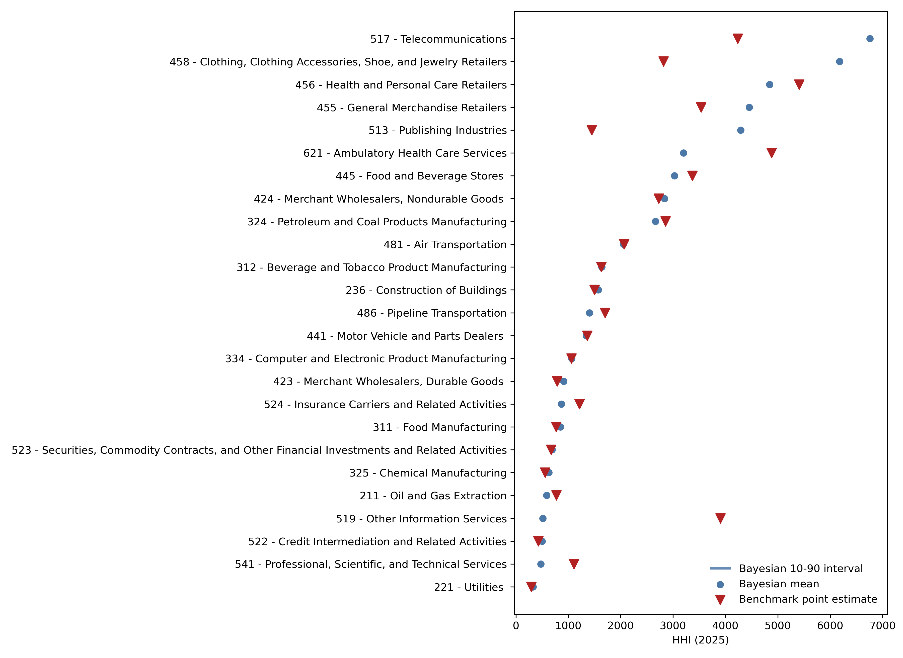
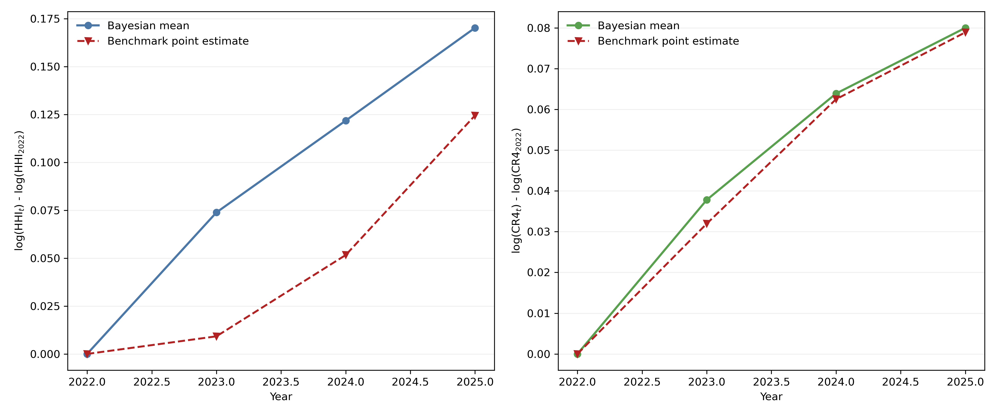
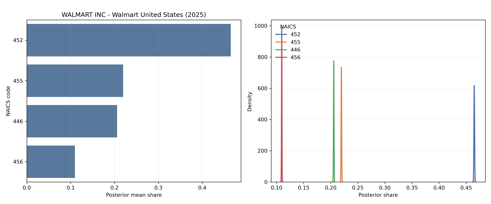
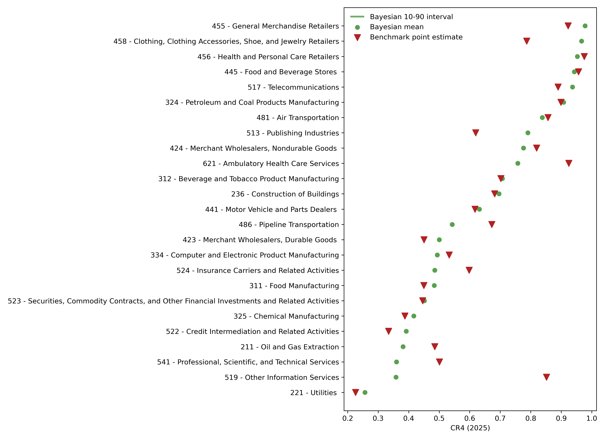
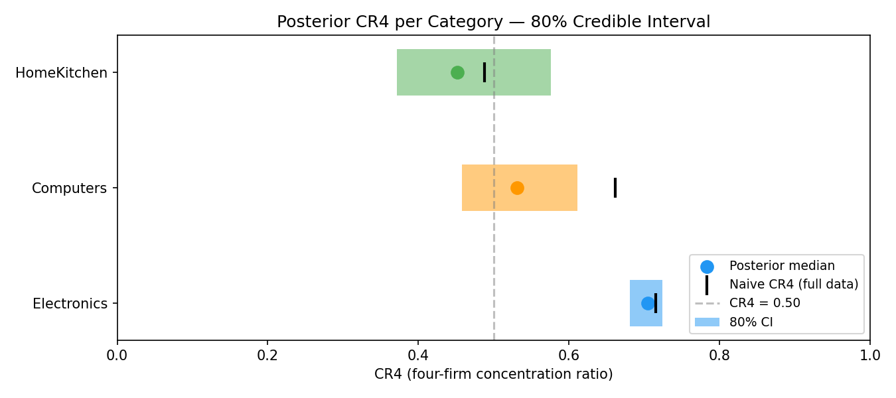

<div align="center">

# Bayesian Market Concentration for Multi-Sector Firms
### Evidence from U.S. Public Firms, 2017–2025

**Dhruvi Gandhi, Josephene Ginting, Zifan Huang, Zach Laurence, Skylar Liu** 

[📄 Slide Deck (PDF)](slides/wrds_slides_submission.pdf) &nbsp;·&nbsp; [💻 Analysis Notebook](code/notebooks/05_wrds_analysis.ipynb) &nbsp;·&nbsp; [🛠 Source Code](code/src/)

</div>

---

## The Measurement Problem

**Standard HHI / CR4 treats firm-industry assignment as known.**

Consider **Amazon North America** (FY2024, $386B in revenue):

| Business Line | Examples |
|---|---|
| Groceries | Whole Foods, Amazon Fresh |
| General merchandise | Amazon.com marketplace |
| Consumer electronics | Alexa, Kindle, Fire TV |
| Digital content + services | Prime Video, AWS |

All of this gets **one NAICS code**.

> **Which market is Amazon actually in?**  
> When the code changes, HHI jumps — not because competition changed.

---

## Prior Literature

Rising U.S. concentration is well-documented:

- **Grullon, Larkin & Michaely (2019):** 75% of industries more concentrated, 1997–2014
- **Autor et al. (2020):** superstar firms capture rising revenue share

**But every study treats the firm-industry map as fixed.**

> **Question:** How much of measured concentration is real consolidation versus an artifact of arbitrary NAICS assignment?

---

## This Paper

> Treat firm-industry allocation as a **latent variable**, identify it from Compustat NAICS co-occurrence, and propagate posterior uncertainty into concentration measures.

**Main findings:**

1. Aggregate HHI rose ≈ **330 points (18%)** from 2022 to 2025
2. Standard benchmark **overstates** concentration *levels* but **understates** growth *over time*
3. Benchmark 2025 HHI lies in the **right tail** of the Bayesian posterior

---

## Data

**Source:** Compustat `wrds_segmerged`, 2017–2025 via WRDS API

<table>
<tr><th></th><th>Sales Panel</th><th>NAICS Count Panel</th></tr>
<tr><td><b>Observations</b></td><td>19,302 segment-year obs</td><td>41,844 segment-industry rows</td></tr>
<tr><td><b>Unique firms</b></td><td>2,932</td><td>—</td></tr>
<tr><td><b>S&P 500 members</b></td><td>241 (current)</td><td>—</td></tr>
<tr><td><b>S&P 500 revenue share</b></td><td>60% of total sales</td><td>—</td></tr>
<tr><td><b>S&P 500 median</b></td><td>$6.8B / segment</td><td>—</td></tr>
<tr><td><b>Unique NAICS codes</b></td><td>—</td><td>862</td></tr>
<tr><td><b>Mean count / row</b></td><td>—</td><td>2.91</td></tr>
<tr><td><b>Max NAICS / segment</b></td><td>—</td><td>12</td></tr>
</table>

*Stable coverage 2019–2022 (~2,200 firms/yr). Partial-year attrition in 2024–2025.*

<details>
<summary>Coverage by Year</summary>

<br>

| Year | Firms | S&P 500 | Seg-Year Obs | Seg-Industry Rows | Total Sales ($M) |
|------|------:|--------:|-------------:|------------------:|-----------------:|
| 2017 | 1,728 | 168 | 1,797 | 3,698 | 3,930,582 |
| 2018 | 2,037 | 197 | 2,139 | 4,472 | 5,739,931 |
| 2019 | 2,238 | 205 | 2,365 | 4,990 | 6,565,125 |
| 2020 | 2,228 | 207 | 2,347 | 5,457 | 6,436,082 |
| 2021 | 2,228 | 207 | 2,355 | 5,636 | 7,196,234 |
| 2022 | 2,209 | 206 | 2,329 | 5,119 | 7,954,571 |
| 2023 | 2,148 | 207 | 2,261 | 4,795 | 8,248,852 |
| 2024 | 2,024 | 203 | 2,102 | 4,365 | 8,260,132 |
| 2025 | 1,508 | 197 | 1,571 | 3,240 | 8,116,667 |
| **All** | **2,932** | **241** | **19,302** | **41,844** | **63,715,822** |

</details>

---

## Model: Bayesian Dirichlet Allocation

*Indices: f = firm, s = segment ∈ f, k = industry, t = year, r = draw*

**Step 1 — Prior:** Sales-weighted pseudo-counts summed over pre-period $\mathcal{T}_0 = 2017$–$2021$:

$$\alpha_{fs,k}^{(0)} = \sum_{t\in\mathcal{T}_0} \underbrace{\frac{c_{fs,k,t}}{C_{k,t}} \cdot S_{k,t}}_{w_{fs,k,t}:\;\text{segment's share of industry }k\text{'s count} \times \text{industry sales}} + \;\varepsilon$$

**Step 2 — Closed-form posterior** for segment $(f,s)$ in year $t$:

$$\pi_{fs,\cdot,t}\mid\text{data} \sim \mathrm{Dirichlet}\!\bigl(\alpha_{fs,\cdot}^{(0)} + w_{fs,\cdot,t}\bigr)$$

**Step 3 — Posterior draws** ($R = 500$) propagate uncertainty into HHI and CR4:

$$\tilde{r}_{f,k,t}^{(r)} = \sum_{s \in f} \pi_{fs,k}^{(r)} \cdot r_{fs,t} \;\Rightarrow\; \text{market shares} \to \text{HHI, CR4}$$

**Benchmark** (no draws): fixed $\hat\pi_{fs,k,t} = c_{fs,k,t}/\sum_{k'} c_{fs,k',t}$ — raw count normalized in year $t$, collapsed to a single allocation vector.

---

## Result 1 — Aggregate HHI Rose 330 Points, 2022–2025

<div align="center">

</div>

> Solid line (circles): Bayesian posterior mean. Dashed line (triangles): benchmark.  
> **Left:** HHI 1,850 → 2,180 &nbsp;|&nbsp; **Right:** CR4 0.59 → 0.64

---

## Result 2 — Benchmark Overstates 2025 Concentration

<div align="center">

</div>

**Finding:** Benchmark (~2,184.5, triangle) lies **right of** the posterior median (~2,182–2,183, dashed line).

**Why?** Fixed weights place revenue in the modal NAICS code → over-concentrates sales for leading firms → inflates HHI and CR4 systematically.

**Posterior is tight** (±1.5 HHI units) → the gap is **bias, not simulation noise**.

---

## Result 3 — Benchmark Overstates Across Industries (2025)

<div align="center">

| HHI | CR4 |
|:---:|:---:|
|  |  |

</div>

> *x*-axis = benchmark, *y*-axis = Bayesian posterior mean.  
> Points **below** the 45° line: benchmark overstates concentration.  
> Pattern holds across most 3-digit NAICS industries.

---

## Result 4 — Cross-Industry Heterogeneity in Posterior Uncertainty

<div align="center">

</div>

Uncertainty in the posterior varies meaningfully across industries — reflecting differences in how diversified firm-segments are across NAICS codes.

---

## Result 5 — Concentration Growth Is Robust

<div align="center">

</div>

> Log-change from 2022 baseline. The **lower bound** of the 2025 credible band is above zero in every post-2022 year.  
> **The trend is structural, not measurement noise.**

---

## Key Findings at the NAICS 3-Digit Level

> **Finding 1: CR4 is more distorted than HHI**  
>
> Traditional HHI point estimates fall closer to — and more often *within* — the Bayesian HHI posterior than traditional CR4 estimates.
>
> **Why:** CR4 is a rank statistic. Small allocation shifts can reshuffle the top-four. HHI is a smooth quadratic — more robust to rank permutations.

<br>

> **Finding 2: Benchmark overstates levels but understates growth**  
>
> Fixed-assignment measures overstate concentration *today* and understate how fast it is rising.
>
> **Why:** The Bayesian series starts from a lower baseline and rises faster. Ambiguous segment revenue is initially allocated more diffusely and shifts toward dominant firms as later-year evidence accumulates. The deterministic benchmark collapses each year to one fixed allocation vector, so it misses this intertemporal uncertainty margin.

---

## Takeaways

| # | Finding |
|:---:|---|
| **1** | **Concentration has risen sharply post-COVID.** Sales-weighted HHI up 330 points (18%) from 2022 to 2025. |
| **2** | **Standard measures overstate concentration levels.** Benchmark sits in the right tail of the Bayesian posterior — systematic bias, not noise. |
| **3** | **...but understate concentration growth.** Fixed yearly assignment misses the steeper trend the Bayesian model reveals once allocation uncertainty is propagated over time. |
| **4** | **CR4 is more distorted than HHI.** Rank-order sensitivity makes CR4 more susceptible to small allocation shifts. |
| **5** | **Both errors matter for measuring competition.** Over-intervention today; under-intervention for growth over time. |

---

## Appendix

<details>
<summary><b>A1 — Segment-Level Dirichlet Posterior</b></summary>

<br>

<div align="center">

</div>

Posterior allocation for a single large 2025 segment with ≥3 NAICS links. Meaningful within-segment uncertainty persists even with an informative prior.

</details>

<details>
<summary><b>A2 — CR4 by Industry, 2025</b></summary>

<br>

<div align="center">

</div>

Benchmark-posterior gap is larger for CR4 than for HHI — fixed allocation inflates top-four share more aggressively than aggregate HHI.

</details>

<details>
<summary><b>A3 — Model Generalizes: Amazon India Demo (Kaggle)</b></summary>

<br>

**Same model, different data.**

| WRDS | Amazon India Analogue |
|---|---|
| Firm-segments | Brands |
| NAICS codes | Product categories |
| NAICS linkage counts | Keyword co-occurrence counts |
| Segment revenue | Price × rating count |

1,465 product listings · 20% evidence sample with revealed categories updates the posterior.

<div align="center">

</div>

**Same pattern reappears:** Naïve benchmark overstates CR4.  
Largest gap in **Computers**: Bayesian 0.53 [0.46, 0.61] vs. Naïve 0.66 (outside CI).  
Electronics: near-agreement (allocation uncertainty is lower).

</details>

---

## Repository Contents

```
assets/
  figures/wrds/     ← WRDS analysis figures (HHI, CR4, posteriors)
  figures/demo/     ← Amazon India demo figure
  tables/wrds/      ← Coverage table (LaTeX source)
slides/
  wrds_slides_submission.pdf   ← Full slide deck
  wrds_slides_submission.tex   ← LaTeX / Beamer source
code/
  notebooks/05_wrds_analysis.ipynb
  src/wrds/generate_summary_tables.py
  src/demo/bayes_brand.py
  src/demo/plot_cr4_posteriors.py
  src/demo/prep_amazon.py
```

**What is excluded:** Proprietary WRDS raw data and processed extracts require licensed WRDS access and are not distributed here. The Amazon demo runs fully without WRDS.
